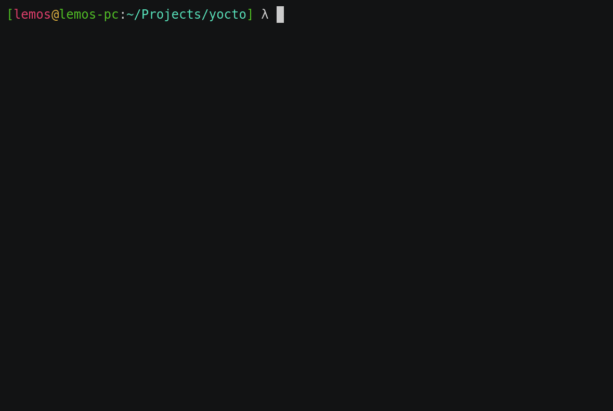

# Yocto
A very simple and lightweight terminal-based text editor written in C, to be improved. My main motivation to start this project was learning C, and apparently I learned it :)

## Todo?
I don't actually know if I will keep working on this project, but I want to do more features, like: C Pre-Processor syntax highlight, lua integration, more languages syntax highlight support, maybe porting to ncurses etc .......

But most important: organize and comment my code :p

## Licensing
Even though I was stuck for 3 days doing this project, you are free to take my code and modify it as you wish (see LICENSE).

## Compiling
First you need to be on a POSIX enviroment (tested only on Linux, but should work on *BSD and MacOS), and then do

```make```

and the binary will be placed on bin/ folder

## Demo
